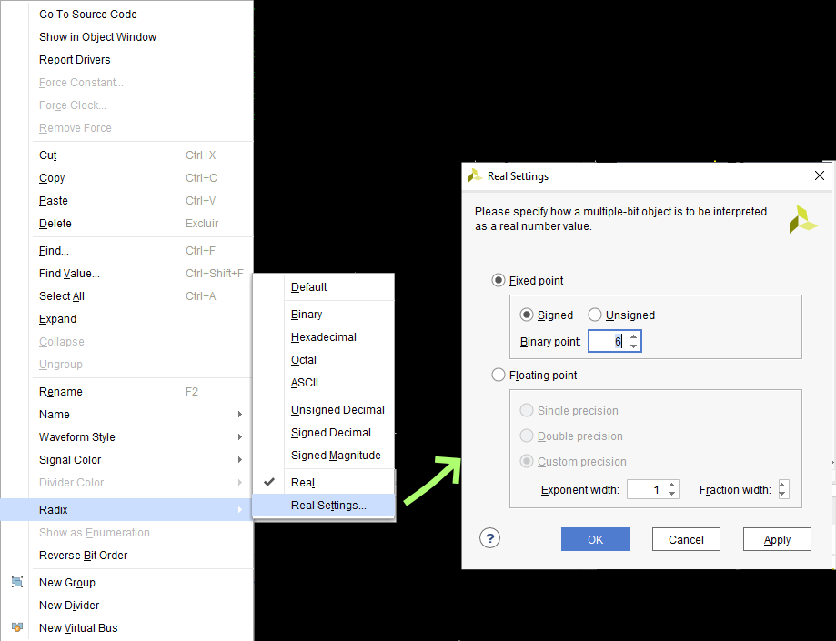
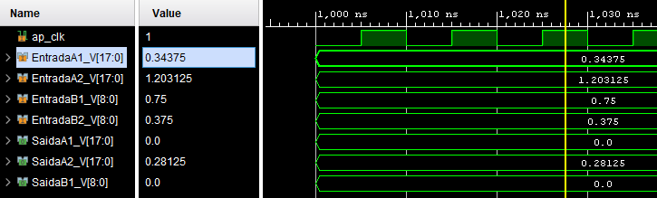

# Conducted Tests

## List of Created IPS

1. **CMFfixMult**: Performs some multiplications
2. **CMFfixMult2**: Performs some multiplications

## List of VIVADO designs

1. **designCMFfixMult**: Tests  **CMFfixMult**
2. **designCMFfixmult2** tests **CMFfixMult2**

## Comentários

* *Ajuste do Tipo da variável*:
Para fácil entendimento dos resultados, é preciso configurar o tipo das variávels para real, clicando com o botão direito nas variável e seguindo o procedimento indicado na próxima figura.

</b>

* *Multiplicações em ponto fixo*:
  Fiz multiplicações envolvendo diferentes tipos de dados no IP **CMFfixMult**. O único caso que deu certo corresponde a linha 14 do código C++, <code>*SaidaB1 = EntradaB1 * EntradaB2;</code>. Aqui, as váriaves de entrada possuem 9 bits, mas a de saída possui 18 bits. Os outros dois cases retornaram valores incoerentes, acredito que seja uma problema de quantização (vide página 635 do [manual do HLS](https://www.xilinx.com/support/documentation/sw_manuals/xilinx2017_4/ug902-vivado-high-level-synthesis.pdf)). Mais uma vez, as coisas có começaram a funcionar a partir de 1000ns.
  

</b>

* *CMFfixMult2*:
Fiz algumas mudanças e usei a técnica to *cast* (<code> *SaidaA2 = dataA_t(EntradaA1 * EntradaA2);</code>) para tentar fazer com que o resutado ficasse correto mesmo quando as entradas e a saída possuiam mesmo número de bites. Não deu certo.

