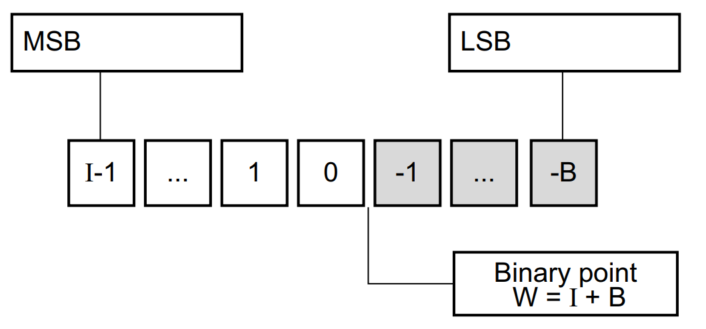
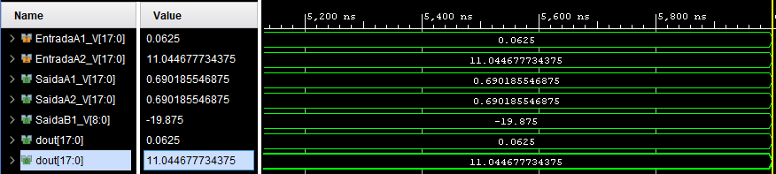
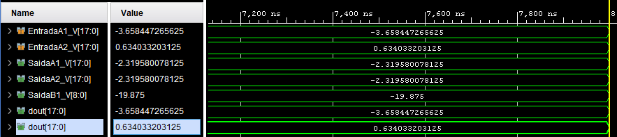
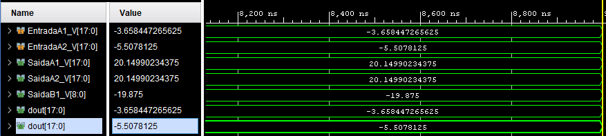
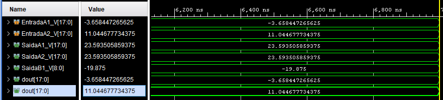

# Conducted Tests

## List of Created IPS

1. **CMFfixMult**: Performs some multiplications
2. **CMFfixMult2**: Performs some multiplications

## List of VIVADO designs

1. **designCMFfixMult**: Tests  **CMFfixMult**
2. **designCMFfixmult2** tests **CMFfixMult2**

## Comentários

* *Ajuste do Tipo da variável*:
Para fácil entendimento dos resultados, é preciso configurar o tipo das variávels para real, clicando com o botão direito nas variável e seguindo o procedimento indicado na próxima figura.

</b>

* *Multiplicações em ponto fixo*:
  Fiz multiplicações envolvendo diferentes tipos de dados no IP **CMFfixMult**. O único caso que deu certo corresponde a linha 14 do código C++, <code>*SaidaB1 = EntradaB1 * EntradaB2;</code>. Aqui, as váriaves de entrada possuem 9 bits, mas a de saída possui 18 bits. Os outros dois cases retornaram valores incoerentes, acredito que seja uma problema de quantização (vide página 635 do [manual do HLS](https://www.xilinx.com/support/documentation/sw_manuals/xilinx2017_4/ug902-vivado-high-level-synthesis.pdf)). Mais uma vez, as coisas có começaram a funcionar a partir de 1000ns.
  

</b>

* *CMFfixMult2*:
Fiz algumas mudanças e usei a técnica to *cast* (<code> *SaidaA2 = dataA_t(EntradaA1 * EntradaA2);</code>) para tentar fazer com que o resutado ficasse correto mesmo quando as entradas e a saída possuiam mesmo número de bites. Não deu certo.

</b>

* *Teoria de ponto fixo*:
  Este site [aqui](https://www.allaboutcircuits.com/technical-articles/multiplication-examples-using-the-fixed-point-representation/) tem um explicação de como são relizadas multiplicações em ponto fixo. Tirei um exemplo de lá:
  
  * A multiplicação de dois sinais de 5 bits gera um resultado de 10 bits
  * O bit mais significativo representa o sinal (1 para negativo e 0 para positivo)
  * O ponto "decimal" pode ser ignorado durante as operações
  * A multiplicação é feita como uma multiplicação nomal, exeto para o bit do sinal. Na multilicação do bit de sinal, o o bit de *b* (1) multiplica o [complemento a dois](https://www.filipeflop.com/blog/complemento-de-dois/) do sinal *a* (00111)
  * Neste exemplo, alguns bites precisam ser inseridos a esqueta para gerar um resultado de 10 bits
Vale a pena dar uma lida com calma neste site

</b> 

* *Erros corrigidos*:
Tinha notado que as multiplicações só funcionavam quando as entradas possuiam menos bits que a saída. Isso foi um engando meu. Percebi que a lógica do *Real Settings* não é a mesma que usamos na definição da biblioteca *ap_fixed*. Por exemplo, em <code>typedef  ap_fixed<18,6, AP_TRN, AP_WRAP> dataA_t;</code> expecificamos que uma variável deste tipo terá 18 bits e o ponto entrará depois do 6 bit da esquerda para direita (do mais significativo, MSB, para o menos significativo, LSB). Vide a figura.
.
A entrada *Binary Point* no *real settings* conta o ponto da direita para esquerda. Ou seja, neste exemplo tem que ser configurada como 12 (não 6). Depois de fazer esta correção, todos os resultados bateram. Deixo aqui alguns resultados obtidos com **designCMFfixmult2**, lembrando que <code>*SaidaA1 = EntradaA1 * EntradaA2;</code> e <code>*SaidaA2 = dataA_t(EntradaA1 * EntradaA2);</code>.

* *Overflow*:
Vejamos o seguinte exemplo:

Existe um erro neste caso porque $ -3.65  \times~ 11.04 = - 40.40 $ e não $23.59$. Aqui houve *overflow* porque o maior valor que podemos representar com 6 bits a esqueda do ponto (um bit de sinal e 2 de valor) é $2^{(6-1)} = 32$. A estratégia do *Warp Arround* acaba produzindo um resultado qualquer (errado). Solução para isso, garatir que nunca o resultado de uma multiplicação (ou de uma soma) vai excede o valor máximo que podemos representar com uma variável.

