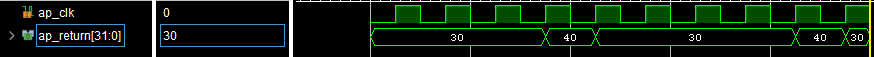
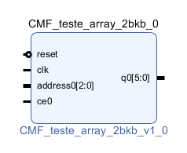

# Principais coisas realizadas/observadas durante o teste

Segui uma abordagem parecida para todos os casos descritos aqui. Primeiro defini uma função C e sintetizei usando o HLS. Na sequência, gerei um IP, já no vidado, para realizar simulações.

## Lista de IPs desenvolvidos

1. **CMF_soma_int** - Faz uma soma de dois inteiros
2. **CMF_testa_array** - Cria uma array e vai colocado cada uma dos elementos dele na saída a medida que a função é chamada (vide os comentários que coloquei na sequência)
3. **CMF_duas_saidas** - Cria um IP com duas saídas
4. **CMF_testa_array_2** - Seria um melhoramento da função **CMF_testa_array**, mas o IP não ficou certo.

## Lista de diagramas do projeto do VIVADO

1. **design_Teste_cmf_soma_int** - Testa o IP **CMF_soma_int**
2. **design_T_cmf_testa_array** - Testa o IP **CMF_testa_arrray**
3. **design_T_cmf_duas_saidas** - Testa o IP **CMF_duas_saidas**
4. **esign_T_cmf_teste_array_2** - incompleto

## Alguns Comentários

* *Clock como entrada no IP*:
Alguns Ips vem com uma entrada de clock, outros não. Os que tem entrada de clock são máquinas de estado (um tipo de [circuito sequêncial](https://pt.wikipedia.org/wiki/L%C3%B3gica_sequencial)) e por isso precisamos ficar atentos a quantos ciclos de clock são necessários para a função interna ser completamente executada. Os IPs que não tem clock são [circuitos combinacionais](https://pt.wikipedia.org/wiki/L%C3%B3gica_combinat%C3%B3ria_(sistemas_digitais)).

* *Delay nas simulações*:
Notei que minhas simulações só iniciam depois de 1000ns. Até lá, não aparecem os sinais. Ainda não sei o porque disso.

* *Tamanho dos caminhos*:
O VIVADO dá problema quando o nome do caminho dos arquivos é muito grande. Entenda que ente nome inclu o próprio nome do arquivo mais o caminhos das pastas onde ele está alocado. No meu caso, tive que colocar estas pastas no desktop para não dar erro, pois alguns nomes ficavam muito grandes se deixa-se na pasta do github. 

* *Geração do IP*:
Dá para ser feita ainda dentro da janela do HLS, sem precisar ir para o VIVADO. Se entendi direito, esta abordagem permite ver quantos ciclos de clock são necessários para execução da função.   

* *HLS e máquinas de estado:*  
Um ponto que precisa ser entendido é que nem tudo que é sintetizado no HLS vira hardware combinacional. Estruturas seriais também são geradas. Tem uma boa explicação disso na página 9 do  [manual do HLS](https://www.xilinx.com/support/documentation/sw_manuals/xilinx2020_1/ug902-vivado-high-level-synthesis.pdf), mas precisamente, na figura 2. Até onde entendi, o codigo em C é sintetizado em uma máquina de estados. Isso é melhor que um código embarcado em um microprocessador, mas não é quase instantâneo como um circuito combinacional. Ou seja, precisamos ficar de olho em quantos ciclos de clock um IP precisa para executar toda a função definida dentro dele.

* *Efeito "Máquina de Estado" em **CMF_testa_arrray**:* 
Na linha 4 do código c, defini um vetor com 5 valores pré estabelescidos (10,20,30,40,50). Minha ideia inicial era colocar cada um deles na saída (return) em cada ciclo de clock. Isso não funcionou por causa da questão da máquina de estado explicada no item anterior. Fiz uma pequena alteração no código, no lugar de **k**, usei dois valores fixos (linha 12 do código) e funcionou. A figura a seguir mostra o resultado de simulação.

* *IPs com  multiplas saídas*:
As multiplas saídas são obtidas usandos [ponteiros](https://www.youtube.com/watch?v=D5QvQmes198). Compare o código com o IP gerado.

* *MF_testa_array_2*:
O IP gerado não ficou certo. Acho que o problema possa ter sido do header file *ap_cint.h*. Veja que nem os nomes vieram certo.

